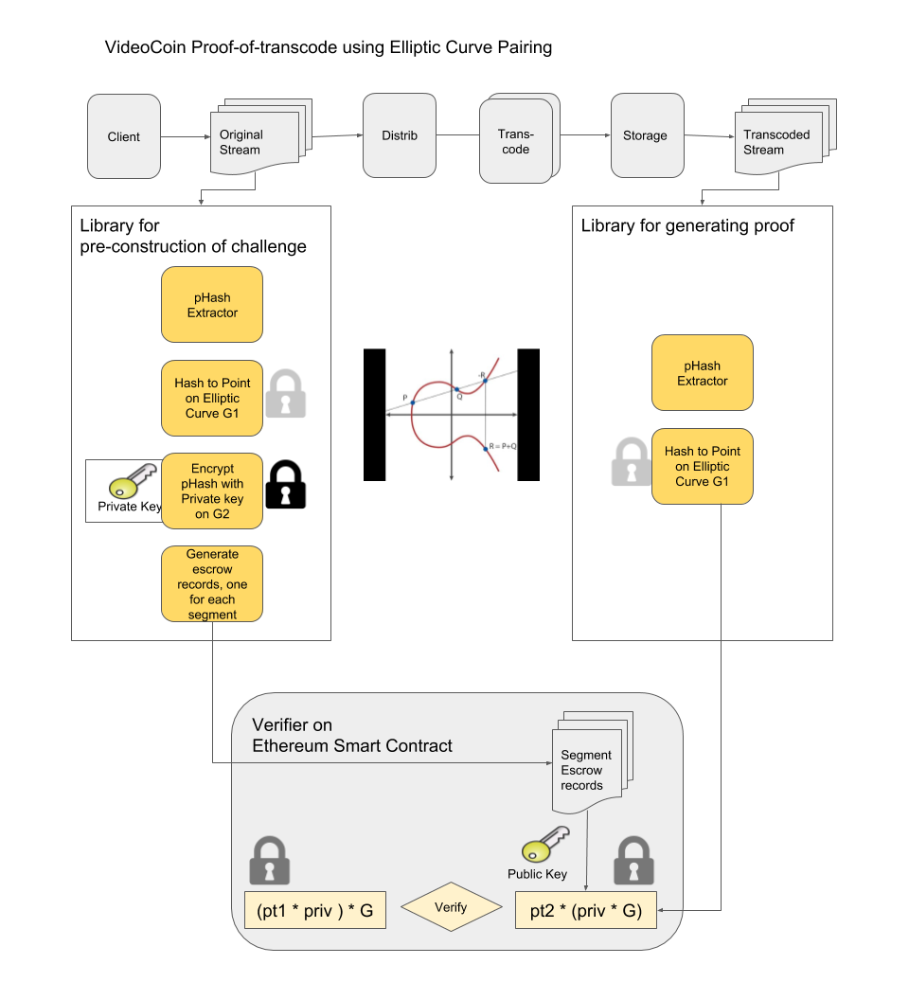

# VideoCoin Proof-of-Transcode using zkSNARKs
This repo contains software modules that implements VideoCoin proof-of-transcode based on zkSNARKs.

zkSNARKs(Zero-Knowledge Succinct Non-Interactive Argument of Knowledge), being integrated in Ethereum byzantium, is a very powerful tool for verification of computations. The the correctness of computations can be verified without having to execute them and verifier will not even learn what was executed.

Existing zkSNARK systems like zCash use it as the transaction verifier. On Ethereum, zkSNARKs would not be limited to a single computational problem, but instead, it could be customized for specialized computational problem. Core support for zkSNARKS in Ethereum is enabled through precompiled contracts EIP196 and EIP197 that provide elliptic curve perations for addition,scaling and pairing check. Refer[4],[5] for details of the Ehtereum precompiled contracts.  

VideoCoin can use the zkSNARKs for proof-of-transcode. zkSNARKs facilitates to move compute intensive proof calculations off-chain and light-weight on-chain verification in a smart-contract. Even though the initial implementations can be based on simple verification of pHashes, it can be hardened to resist any security attacks. Refer [7] for detailed description of zkSNARks and for a lighter reading refer to the blog post [12] 

zkSNARKs uses Elliptic curve pairing for homomorphic hiding / encoding / encryption. Elliptic curve pairings are a recent addition to cryptography and fuelling advancements in the blockchain technologies. There are several blockchain applications of elliptic curve pairings that include Identity Based Encryption, Non-interactive Zero Knowledge proofs, Short Signatures etc. Refer [1],[2],[3] for detailed description of Elliptic Curve Pairing. In addition to elliptic curve pairing, a stage in the zk-SNARKS involves translation of computations into polynomials called a Quadratic Arithmetic Program (QAP). Computations are first converted to an Arithmetic circuit. An arithmetic circuit consists of gates computing arithmetic operations like addition and multiplication, with wires connecting the gates.

The proof-of-transcode includes three modules that includes the following:
### (A) A library that runs in the context of VideoCoin client that performs the following:
(i)  Extracts pHash of a frame for each video segment at predetermined offset,\
(vi) Generates an escrow record for the video segment that includes a unique id for the video segment, encrypted pHash and reward information and registers with smart contract.

### (B) A library that runs in the context of Transcoder(or Storage Miner) that performs the following:
(i)  Extracts pHash of a frame for each video segment \
(ii) Generate the zkSNARKS proof supplying encrypted pHash as witness  \
(iii)Send the zkSNARKS proof to the smart-contract to claim the transcode mining reward.\

### C) An Ethereum smart contract that performs the following:
(i)  Maintains escrow records for video segment transcode requests. Each escrow record contains the precomputed challenge supplied by the client library along with mining reward amount,\
(ii) Smart-contract also contains the zkSNARKS verification keys and algorithm embedded (which uses Ethereum precompiled contracts)\
(iii) The call from the miner(prover) assembles the input&witness from the supplied arguments and retrieving the encrypted hash values from the escrow records corresponding to the segment. If the verification is successful, it transfers the reward to miner's account.

## Attack analysis of proof-of-transcode and advantages of zkSNARks
The proof-of-transcode could have been implemented in simple steps that inlcude (i) the VideoCoin clinet can register a hashed pHash with the smart-contract and (ii) transcode miner can submit the pHash(key) and smart-contract can create a hash of this and verify the claim. Used directly like this is insecure: Once the transaction is published, another verifier node could just drop the original transaction and create a new transaction that pays to it instead. zkSNARKs hides the details using elliptic curve homo-morphing and verifier can not learn the original solution of the proof.

zkSNARKs integration with Ethereum is very new and in its initial phase. There may be security issues because of this, but it is expected to be hardened expected to be in good shape. 

## Performance and scalability proof-of-transcode
The zero-knowledge feature of zkSNARKS property allows the prover to hide details about the computation from the verifier in the process, and so they are useful for both privacy and performance. This enables a embedding verifier in a smart-contract and offload most of the computation to prover. As the smart-contract runs on all the blockchain nodes and prover runs only on one client, this helps achieve scalability.

## Status
An Ethereum Smartcontract supporting zkSNARKs based verification is developed using a tool called Zokrates[17]. This tool allows definitin of zkSNARKs verification system using DSL(Domain Specific Language) and generates smart contract for Ethereum. While generating the zkSNARKs proofs, the parameters can be partitioned to two sets called inputs and witness. Moving the parameters to witness protects them from verifier. Currently all the parameters are under inputs and needs to be changed as witness. 

TODO:
The zkSNARKs proof libraries needs to be integrated with the transcode miner and VideoCoin client libraries.

### References
[1. Exploring Elliptic Curve Pairings,by Vitalik Buterin](https://medium.com/@VitalikButerin/exploring-elliptic-curve-pairings-c73c1864e627)

[2. Having Fun With BN-curves,by Prof Bill Buchanan OBE](https://medium.com/coinmonks/having-fun-with-bn-curves-37fb5b816f67)

[3. Pairings for beginners,by Craig Costello](http://www.craigcostello.com.au/pairings/PairingsForBeginners.pdf)

[4. Precompiled contracts for addition and scalar multiplication on the elliptic curve alt_bn128,by Vitalik Buterin](https://github.com/ethereum/EIPs/blob/master/EIPS/eip-196.md)

[5. Precompiled contracts for optimal ate pairing check on the elliptic curve alt_bn128,by Vitalik Buterin ](https://github.com/ethereum/EIPs/blob/master/EIPS/eip-197.md)

[6. Mathematical Foundations of Elliptic Curve Cryptography,by C Koppensteiner ](http://dmg.tuwien.ac.at/drmota/koppensteinerdiplomarbeit.pdf)

[7. Succinct Non-Interactive Zero Knowledge for a von Neumann Architecture,by Eli Ben-Sasson et al.](https://eprint.iacr.org/2013/879.pdf)

[8. Scalable, transparent, and post-quantum secure computational integrity,by Eli Ben-Sasson et al ](https://eprint.iacr.org/2018/046.pdf)

[9. Bulletproofs: Short Proofs for Confidential Transactions and More, by Benedikt B¨unz et al ](https://eprint.iacr.org/2017/1066.pdf)

[10. Pinocchio: Nearly Practical Verifiable Computation, by Bryan Parno et al ](https://eprint.iacr.org/2013/279.pdf)

[11. A multi-party protocol for constructing the public parameters of the Pinocchio zk-SNARK, by Sean Bowe et al ](https://eprint.iacr.org/2017/602.pdf)

[12. zkSNARKs in a nutshell, by Christian Reitwiessner ](https://blog.ethereum.org/2016/12/05/zksnarks-in-a-nutshell/)

[13. Reducing Shielded Proving Time in Sapling, by Paige Peterson ](https://z.cash/blog/reducing-shielded-proving-time-in-sapling/)

[14. Zcash Protocol Specification, by Sean Bowe et al ](https://github.com/zcash/zips/blob/master/protocol/protocol.pdf)

[15. Zcash Protocol Specification, by Jacob Eberhardt et al ](https://www.ise.tu-berlin.de/fileadmin/fg308/publications/2018/2018_eberhardt_ZoKrates.pdf)

[16. zk-SNARK explained: Basic Principles, by Hartwig Mayer ](https://www.researchgate.net/profile/Hartwig_Mayer/publication/321124635_zk-SNARK_explained_Basic_Principles/links/5a0e4a810f7e9b7d4dba61eb/zk-SNARK-explained-Basic-Principles.pdf)

[17.ZoKrates Opensource tool for zkSNARKs, by Sean Bowe et al ](https://github.com/Zokrates/ZoKrates)
