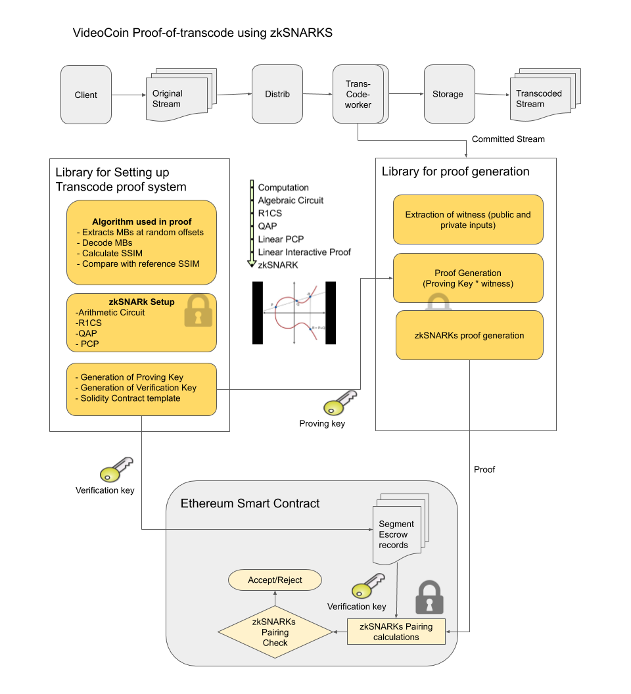

# VideoCoin Proof-of-Transcode using zkSNARKs
This repo contains software modules that implements VideoCoin proof-of-transcode based on zkSNARKs.

## Conceptual Overivew of zkSNARKs for VideoCoin Proof-of-Transcode
zkSNARKs(Zero-Knowledge Succinct Non-Interactive Argument of Knowledge), being integrated in Ethereum byzantium, is a very powerful tool for verification of computations. The the correctness of computations can be verified without having to execute them and verifier will not even learn what was executed.

Existing zkSNARK systems like zCash use it as the transaction verifier. On Ethereum, zkSNARKs would not be limited to a single computational problem, but instead, it could be customized for specialized computational problem. Core support for zkSNARKS in Ethereum is enabled through precompiled contracts EIP196 and EIP197 that provide elliptic curve operations for addition,scaling and pairing check. Refer[4],[5] for details of the Ehtereum precompiled contracts.  

VideoCoin can use the zkSNARKs for proof-of-transcode by using a video quality metric called SSIM(Structural Similarity Index). zkSNARKs facilitates to move compute intensive proof calculations off-chain and light-weight on-chain verification in a smart-contract. Even though the initial implementation of proof-system include basic algorithm, it can be hardened to resist any security attacks. Refer [7] for detailed description of zkSNARks and for a lighter reading refer to the blog post [12] 

zkSNARKs uses Elliptic curve pairing for homomorphic hiding / encoding / encryption. Elliptic curve pairings are a recent addition to cryptography and fuelling advancements in the blockchain technologies. There are several blockchain applications of elliptic curve pairings that include Identity Based Encryption, Non-interactive Zero Knowledge proofs, Short Signatures etc. Refer [1],[2],[3] for detailed description of Elliptic Curve Pairing. In addition to elliptic curve pairing, a stage in the zk-SNARKS involves translation of computations into polynomials called a Quadratic Arithmetic Program (QAP). Computations are first converted to an Arithmetic circuit. An arithmetic circuit consists of gates computing arithmetic operations like addition and multiplication, with wires connecting the gates.

The following diagram shows an overview of video-coin proof-of-transcode using zkSNARKS. We use  SSIM generated by the proof system from a macroblock at random offsets in the committed transcoded stream.    



The proof-of-transcode includes the following modules:
### (A) Library for Setting up Transcode proof system
* Computation (algorithm) that performs the following  
  * Extracts MBs at random offsets  
  * Decode MBs  
  * Calculate SSIM
  * Compare with reference SSIM  
* Generation of keys
  * Generation of Proving Key
  * Generation of Verification Key
  * Solidity Contract template

### (B) Library for proof generation:
* Extraction of witness (public and private inputs) which consists macroblocks from source and transcoded streams.  
* Proof generation using the witness and proving-key


### C) An Ethereum smart contract that performs the following:
*  Maintains escrow records for video segment transcode requests. Each escrow record contains the precomputed challenge supplied by the client library along with mining reward amount,\
* Smart-contract also contains the zkSNARKS verification keys and algorithm embedded (which uses Ethereum precompiled contracts)\
* The call from the miner(prover) assembles the input&witness from the supplied arguments and retrieving the encrypted hash values from the escrow records corresponding to the segment. If the verification is successful, it transfers the reward to miner's account.

### Performance and scalability of proof-of-transcode
The zero-knowledge feature of zkSNARKS property allows the prover to hide details about the computation from the verifier in the process, and so they are useful for both privacy and performance. This enables a embedding verifier in a smart-contract and offload most of the computation to prover. As the smart-contract runs on all the blockchain nodes and prover runs only on one client, this helps achieve scalability.
 
## Implementation Overview  
Most of the zkSnarks frameworks are based on a library called [libsnark](https://github.com/scipr-lab/libsnark). The following diagram (excerpted from [26]) shown below gives the overview of the stack:  

  

The library consists several alternate implementations for front-end, back-end and algorithmic layers that allow the application to choose from this set or replace with custom components. We use two front-ends indicatged below for experimentation and final implementation.
* [Zokrates: A toolbox for zkSNARKs on Ethereum](https://github.com/Zokrates/ZoKrates)  
* [Pepper/Pequin: A system for verifying outsourced computations, and applying SNARKs](https://github.com/pepper-project/pequin)

### Key generation, proof generation and verification
zkSnarks includes three steps:
* A one-time setup phase where required Computation is transformed to zkSnarks proover key and verification key through several internal steps that include Algebraic circuit generation, R1CS and QAP. It also includes generation of random values that are used in generation of the keys and discarded (anyone accessing these random values, if not properly discarded, can create attacks).
* Proof generation that uses proving key generated in the previous phase, public input and private secret that prover knows as part of performing computation. This proof is sent to the verifier.
* Verification processes uses verification key, proof and public input and performs verification based Elliptic Curve homo-morphing.   


### Relation between proof gsystem and video transcode process

The zkSnarks proof is expected to satisfy a compliance predicate: 
```
C(input, code, output)

input  - input bitstream and transcode options 
output - output bit stream
code   - decode and encode opertation conforming to required transcode options
```

Incase of Transcode Verification, "input" is source bitstream and transcode options, "output" is transcoded bit stream and "code" is transcode operation. The representation of the above compliance predicate requires huge computation power on the part of prover. There are  attempts such as in ref[21] to apply it for image transformation.

The current implementation of Transcode Verification uses a simplified proof generation where input consists of few macroblocks randomly selected from the source and transcoded streams.


 
The proof system includes bitstream(macroblock) decode calculation of video quality metrics SSIM. The proof system is described in the following sections in more detail. Public input includes a reference SSIM submitted by the client. The macroblocks are selected at random offset in video segment. The offets are calculated based on the hash of the transcoded stream. The number of macroblocks used in the proof should create hurdle to generate fake proofs. The SSIM generated in the proof system is compared against  reference SSIM to fall with in a range. This ensures the transcode operation is carried with the specified transcode parameters. The proof system may use additional public and private inputs that may be submitted by upstream and downstream nodes. These additional parameters such as hashes macroblocks being used for proof generation will ensure the source and transcoded streams are consistant along the pipeline. 

### Outline of the proof generation and verification using SSIM Macro-blocks

#### Public Inputs

This section describes the public Inputs for the proof and verification:


* Input Stream Hash: Wallet registers a digest(hash of the input stream segment) with the smart contract along with the trancode request.
* Output Stream Hash: The miner generates a digest(hash of the transcoded stream) to be used in the proof. A storage miner can generate the digest on the received segment and update to the smart contract.

A random macroblock for verification is selected based on a hash generated from hashes of input and output streams. Offset of the frame containing the macroblock and offset of the slice/macroblock in the frame is obtained from the hash value.

* Input Macroblock Hash: Miner will generate and inlcude hash of the input macroblock. It also stores the digest with the smart contract. 
* Output Macroblock Hash: Miner will generate and inlcude hash of the output macroblock. It also stores the digest with the smart contract.
* Compression Ratio: Used for generating expected SSIM


#### Operations at Miner:
* A. Validate the input stream using the digest stored by the wallet in the smart contrct
* B. Perform the transcode operation
* C. Sent the stream to the storage.
* D. Generate digest for output stream
* E. Generate proof. The proof includeds following constraint system
* E.1 Generation of hash from hashes of input stream and output stream hashes 
* E.2 Selection of input and output macrobocks based on hash in E.1
* E.3 Decode Macroblocks
* E.4 Generate SSIM
* E.5 Compare against threshold generated based on public input "compression ratio"

#### Verification:
* A. Validate for public inputs: Input stream hash is supplied by Wallet. Output stream hash is supplied by Miner (and optionally retrieved by Verifier, See Note-1 below)
* B. Hasahes for input and output macroblocks are supplied by the Miner (and optionally retrieved by Verifier. , See Note-1 below ) 
* C. Generate Elliptic Curve Pairing points using proof and public inputs and check for pairing using Ethereum precompiled contracts

Note-1: Automated(Smart Contract based) dispute resolution:
Using hashes of input and output macrobocks in the proof allows automated resolution if there is a dispute between Wallet/Storage and Miner.


### TinyRAM 
TinyRAM [23] is used to support general computations written in high level languages. So, we can apply macro-block decoding as timyRAM program to get computational proofs.
To achieve this we have to go though few steps:
* Macro-block decoding algorithm should be converted into tinyRAM assembly code. 
* Assembly code should be generated into small circuits that checks correct execution.
* After feeds those circuits into zkSNARK to generate the proofs.

On of the key challenges right now to find the way to generate tinyRAM assembly code from hight level C program due to lack of tinyRAM compiler.
Alternative way to implement circuits for macro-block decoding is to use pepper project [24].


### SSIM calculation using Pepper [24]
Core implementation of SSIM was taken from https://github.com/mirror/x264/blob/master/common/pixel.c#L688 and adapted for Pepper compiler https://github.com/VideoCoin/zktransverify/blob/pepper/src/pequin/pepper/apps/x264_ssim_16x16.c.
Three separate SSIM calculation were implemented for frame sizes 16x16, 32x32 and 64x64 respectively (Pepper doesn't support dynamic parameters this is the reason to have three SSIM calculations).

Algorithm works with frames in YUV format. Luma component (Y) is used for SSIM calculation.

| Frame | Input Variables | Proving key size | Verification key size | Proving time (Intel Core i7 2.8 GHz, 4vCPU 12GB RAM) | Proving time (Intel Xeon 2.2 GHz, v8CPU 16GB RAM) |
|-------|:---------------:|:----------------:|:---------------------:|:--------------------------------:|:----------------------------------------:|
| 16x16 |             512 |            57 MB |                121 kB |                         2.6691 s |           2.3168 s |
| 32x32 |            2048 |         277.4 MB |                180 kB |                        11.6607 s |         11.3058 s |
| 64x64 |            8192 |           1.3 GB |                420 kB |                       58.8939s s |    52.7337 s                      |           

Verification time for all cases ~5 ms.


## Status
The current implementation is only tested in a simulated environment. The zkSNARKs proof libraries needs to be split and integrated with the transcode miner and VideoCoin client libraries.


### References
[1. Exploring Elliptic Curve Pairings,by Vitalik Buterin](https://medium.com/@VitalikButerin/exploring-elliptic-curve-pairings-c73c1864e627)

[2. Having Fun With BN-curves,by Prof Bill Buchanan OBE](https://medium.com/coinmonks/having-fun-with-bn-curves-37fb5b816f67)

[3. Pairings for beginners,by Craig Costello](http://www.craigcostello.com.au/pairings/PairingsForBeginners.pdf)

[4. Precompiled contracts for addition and scalar multiplication on the elliptic curve alt_bn128,by Vitalik Buterin](https://github.com/ethereum/EIPs/blob/master/EIPS/eip-196.md)

[5. Precompiled contracts for optimal ate pairing check on the elliptic curve alt_bn128,by Vitalik Buterin ](https://github.com/ethereum/EIPs/blob/master/EIPS/eip-197.md)

[6. Mathematical Foundations of Elliptic Curve Cryptography,by C Koppensteiner ](http://dmg.tuwien.ac.at/drmota/koppensteinerdiplomarbeit.pdf)

[7. Succinct Non-Interactive Zero Knowledge for a von Neumann Architecture,by Eli Ben-Sasson et al.](https://eprint.iacr.org/2013/879.pdf)

[8. Scalable, transparent, and post-quantum secure computational integrity,by Eli Ben-Sasson et al ](https://eprint.iacr.org/2018/046.pdf)

[9. Bulletproofs: Short Proofs for Confidential Transactions and More, by Benedikt B¨unz et al ](https://eprint.iacr.org/2017/1066.pdf)

[10. Pinocchio: Nearly Practical Verifiable Computation, by Bryan Parno et al ](https://eprint.iacr.org/2013/279.pdf)

[11. A multi-party protocol for constructing the public parameters of the Pinocchio zk-SNARK, by Sean Bowe et al ](https://eprint.iacr.org/2017/602.pdf)

[12. zkSNARKs in a nutshell, by Christian Reitwiessner ](https://blog.ethereum.org/2016/12/05/zksnarks-in-a-nutshell/)

[13. Reducing Shielded Proving Time in Sapling, by Paige Peterson ](https://z.cash/blog/reducing-shielded-proving-time-in-sapling/)

[14. Zcash Protocol Specification, by Sean Bowe et al ](https://github.com/zcash/zips/blob/master/protocol/protocol.pdf)

[15. Zcash Protocol Specification, by Jacob Eberhardt et al ](https://www.ise.tu-berlin.de/fileadmin/fg308/publications/2018/2018_eberhardt_ZoKrates.pdf)

[16. zk-SNARK explained: Basic Principles, by Hartwig Mayer ](https://www.researchgate.net/profile/Hartwig_Mayer/publication/321124635_zk-SNARK_explained_Basic_Principles/links/5a0e4a810f7e9b7d4dba61eb/zk-SNARK-explained-Basic-Principles.pdf)

[17.ZoKrates Opensource tool for zkSNARKs, by Sean Bowe et al ](https://github.com/Zokrates/ZoKrates)

[18.Verified computation and its applications,course conclusion, by Eran Tromer](http://www.cs.tau.ac.il/~tromer/istvr1516-files/lecture12-verified-computation.pdf)

[19.A scalable verification solution for blockchains, by Jason Teutsch et al ](https://people.cs.uchicago.edu/~teutsch/papers/truebit.pdf)

[20.WIP PoC verification system for the Livepeer protocol using Truebit ](https://github.com/livepeer/verification-truebit)

[21. PhotoProof: Cryptographic Image Authentication for Any Set of Permissible Transformations, by Assa Naveh et al ](https://www.cs.tau.ac.il/~tromer/papers/photoproof-oakland16.pdf)

[22. Code performance improvement scheme for X264 based on SSIM, by Weilin Wu et al ](https://ieeexplore.ieee.org/document/6418782)

[23. Succinct Non-Interactive Zero Knowledge for a von Neumann Architecture](https://eprint.iacr.org/2013/879.pdf)

[24. The Pepper Project](http://www.pepper-project.org)

[25. Analysis and Implementation of the H.264 CABAC entropy decoding engine, by Martinus Johannes Pieter Berkhof](http://ce-publications.et.tudelft.nl/publications/214_analysis_and_implementation_of_the_h264_cabac_entropy_decod.pdf)  

[26. On Deploying Succinct Zero-Knowledge Proofs, by Madars Vizra ](https://madars.org/phd-thesis/Madars-Virza-thesis-20170831.pdf)

