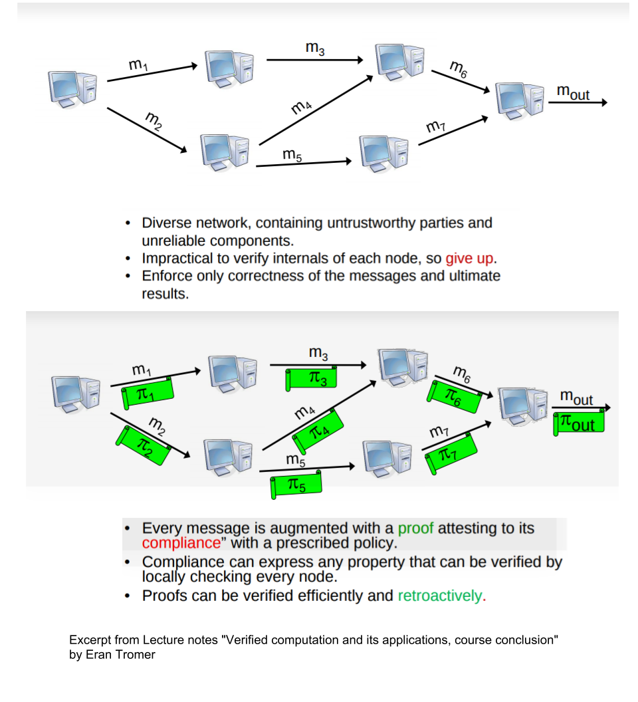
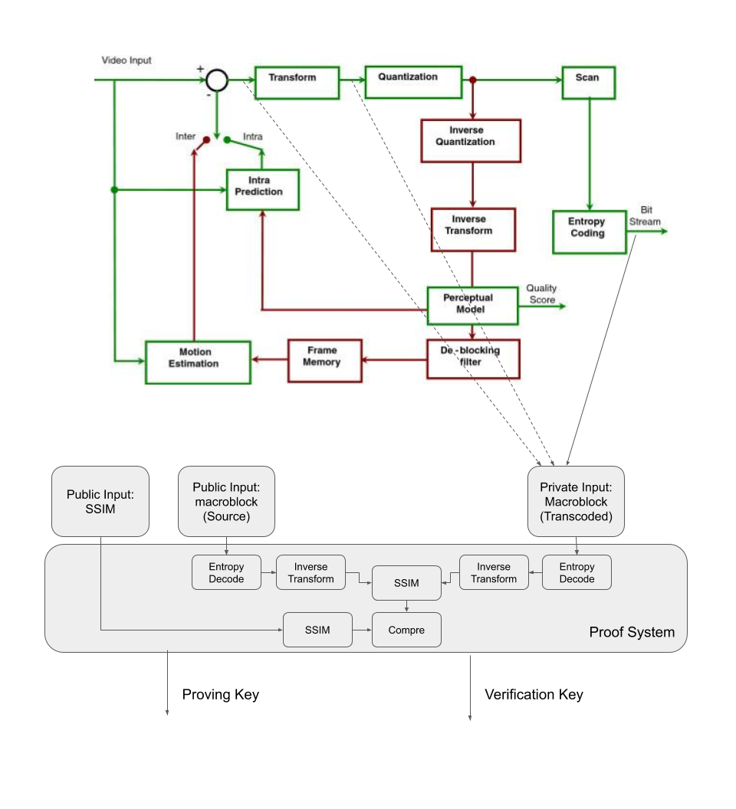
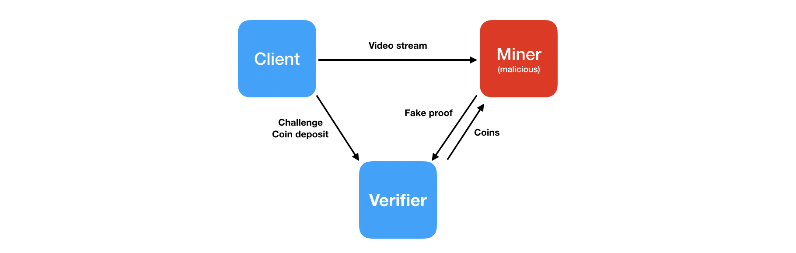

# VideoCoin Proof-of-Transcode using zkSNARKs
This repo contains software modules that implements VideoCoin proof-of-transcode based on zkSNARKs.

zkSNARKs(Zero-Knowledge Succinct Non-Interactive Argument of Knowledge), being integrated in Ethereum byzantium, is a very powerful tool for verification of computations. The the correctness of computations can be verified without having to execute them and verifier will not even learn what was executed.

Existing zkSNARK systems like zCash use it as the transaction verifier. On Ethereum, zkSNARKs would not be limited to a single computational problem, but instead, it could be customized for specialized computational problem. Core support for zkSNARKS in Ethereum is enabled through precompiled contracts EIP196 and EIP197 that provide elliptic curve operations for addition,scaling and pairing check. Refer[4],[5] for details of the Ehtereum precompiled contracts.  

VideoCoin can use the zkSNARKs for proof-of-transcode. zkSNARKs facilitates to move compute intensive proof calculations off-chain and light-weight on-chain verification in a smart-contract. Even though the initial implementations can be based on simple verification of pHashes, it can be hardened to resist any security attacks. Refer [7] for detailed description of zkSNARks and for a lighter reading refer to the blog post [12] 

zkSNARKs uses Elliptic curve pairing for homomorphic hiding / encoding / encryption. Elliptic curve pairings are a recent addition to cryptography and fuelling advancements in the blockchain technologies. There are several blockchain applications of elliptic curve pairings that include Identity Based Encryption, Non-interactive Zero Knowledge proofs, Short Signatures etc. Refer [1],[2],[3] for detailed description of Elliptic Curve Pairing. In addition to elliptic curve pairing, a stage in the zk-SNARKS involves translation of computations into polynomials called a Quadratic Arithmetic Program (QAP). Computations are first converted to an Arithmetic circuit. An arithmetic circuit consists of gates computing arithmetic operations like addition and multiplication, with wires connecting the gates.

The following diagram shows an overview of video-coin proof-of-transcode using zkSNARKS. We use  information retrieved from the original stream by the client as public input and information retrieved from the transcoded by the miner bitstream as   encrypted pHash supplied by  client as private input to the proof-generation system. In the following diagram we used encrypted pHash to explain the proof generation and verification. But the final implementation incorporates bit-stream syntax elements such as macro-blocks and video quality metrics SSIM as explained in the following sections of this document.  


The proof-of-transcode includes three modules that includes the following:
### (A) A library that runs in the context of VideoCoin client that performs the following:
(i)  Extracts pHash of a frame for each video segment at predetermined offset,\
(vi) Generates an escrow record for the video segment that includes a unique id for the video segment, encrypted pHash and reward information and registers with smart contract.

### (B) A library that runs in the context of Transcoder(or Storage Miner) that performs the following:
(i)  Extracts pHash of a frame for each video segment \
(ii) Generate the zkSNARKS proof supplying encrypted pHash as witness  \
(iii)Send the zkSNARKS proof to the smart-contract to claim the transcode mining reward.\

### C) An Ethereum smart contract that performs the following:
(i)  Maintains escrow records for video segment transcode requests. Each escrow record contains the precomputed challenge supplied by the client library along with mining reward amount,\
(ii) Smart-contract also contains the zkSNARKS verification keys and algorithm embedded (which uses Ethereum precompiled contracts)\
(iii) The call from the miner(prover) assembles the input&witness from the supplied arguments and retrieving the encrypted hash values from the escrow records corresponding to the segment. If the verification is successful, it transfers the reward to miner's account.

## Attack analysis of proof-of-transcode and advantages of zkSNARks
The proof-of-transcode could have been implemented in simple steps that inlcude (i) the VideoCoin client can register a hashed pHash with the smart-contract and (ii) transcode miner can submit the pHash(key) and smart-contract can create a hash of this and verify the claim. Used directly like this is insecure: Once the transaction is published, another verifier node could just drop the original transaction and create a new transaction that pays to it instead. zkSNARKs hides the details using elliptic curve homo-morphing and verifier can not learn the original solution of the proof.

zkSNARKs integration with Ethereum is very new and in its initial phase. There may be security issues because of this, but it is expected to be hardened and evloves to  a good shape.

### List of possible attacks with the above implementation and future enehancements
* A transcode miner may generate a proof based on source stream instead of transcoded stream. Video Coin  proof-of-transcode will be extended to use additional parameters extracted from bitstream as described under the section “Macro-block decode based verification” to prevent this attack. 
* A client submitting a transcode request may provide a challenge data that may never be satisfied by transcode miner. We will be researching on extending proof-of-transcode to make use of concepts discussed under  the section “Proof Carrying Data” below  to prevent this kind of attacks.

## Performance and scalability of proof-of-transcode
The zero-knowledge feature of zkSNARKS property allows the prover to hide details about the computation from the verifier in the process, and so they are useful for both privacy and performance. This enables a embedding verifier in a smart-contract and offload most of the computation to prover. As the smart-contract runs on all the blockchain nodes and prover runs only on one client, this helps achieve scalability.

## PCD (Proof Carrying Data): key concept of zkSnarks
zkSnarks involves an important concept of  Proof Carrying Data(PCD) that requires data processing occurring at different nodes  generates a proof confirming processing of the data. The data carries the proof as it moves between nodes. Refer [18] for more details. The following diagram is an excerpt from the this lecture notes. 

 

### Review of Video Coin Transcode Verify with respect to PCD
In the implementation of Video Coin transcode verification, we deviate from PCD:
* Proof is passed through Ethereum Smart Contract, instead of associating with the data.
* We rely on pHash extracted from the data (to represent both source and transcoded data) instead of actual stream data.
* The usage of same pHash values to represent both source and transcoded data may lead to attacks that a miner can use to fake transcode operation and claim the associated reward. There are two possible ways that this may be handled:
  * Using a down-stream node such as Storage-Miner to generate the proof from transcoded and committed stream. Verification will be done by the Smart Contract.
  * An alternate approach is to augment the pHash generation with transcode metrics such as PSNR and integrate the proof generation with encode process as explained the section [Tight association of proof generation with encode process](#enhancements1) 

 
## Implementation details of video Transcode Verification using zkSnarks

The implementation consists of creation of a zkSnarks gadget which in turn makes use of other gadgets from gadget library. This facilitates ciruitizing complex computations with a small c++ program. The source code for the gadget is located at: 


This implementation of the Transcode Verification based on [libsnarks](https://github.com/scipr-lab/libsnark). The implementation actually uses an older version of libsnarks that is being used by the github project [libsnark tutorial](https://github.com/christianlundkvist/libsnark-tutorial). 

A snapshot of the code base including libsnarks and dependent libraries are located at: [libsnarkswrap](./src/libsnarkwrap.tgz). This snapshot includes the Transcode Verification gadget code along with the libsnarks and dependent libraries. 

The verifier will be part of ethereum smart contract. The verification key generated by Transcode Verification gadget code can be included inlcuded in the [zkSnarks smart contract template](https://github.com/christianlundkvist/libsnark-tutorial/blob/master/src/ethereum/contracts/Verifier.sol). This smart contract uses wrappers for Ethereum precompiled contracts to perform zkSnarks ec pairing checks for the ec points generated from proof, public input and verification keys.

### building videocoin gadget
Extract the libsnarkwrap.tgz to a folder on the build system and run the following commands to build it.
```
mkdir build
cd build/
cmake -DCMAKE_BUILD_TYPE=Debug ..
make
```
The binary will be generated in src/videocoin

### Key generation, proof and verification
zkSnarks includes three steps:
* A one-time setup phase where required Computation is transformed to zkSnarks proover key and verification key through several internal steps that include Algebraic circuit generation, R1CS and QAP. It also includes generation of random values that are used in generation of the keys and discarded (anyone accessing these random values, if not properly discarded, can create attacks).
* Proof generation that uses proving key generated in the previous phase, public input and private secret that prover knows as part of performing computation. This proof is sent to the verifier.
* Verification processes uses verification key, proof and public input and performs verification based Elliptic Curve homo-morphing. 

As shown in the following diagram, pHash obtained from the source stream play the role of public input. pHash obtained from the transcoded stream forms the private secret of the miner.  


### Details of Elliptic Curve Pairing Computations used in Video Transcode Verification
Ideally the whole transcode process needs to be used for generating zkSnarks keys. The current implementation uses only comparison of pHashes generated from source and transcoded streams instead. 


We use elliptic curve homo-morphing to encrypt the pHash from the source stream that acts as a public key. The pHash(x) is encrypted as a relation P2=xP1 on curve G1. The miner encrypts the pHash from transcoded stream as relation Q1=yQ2 on curve G2. If the pairing check e(P1,Q1) == e(P2,Q2) satisfies on GT, then it pHashes should match.

Please note that the elliptic curve based computation used in the Transcode Verification gadget is independent of elliptic curve based zkSnarks proof/verification system.

## <a name="enhancements1">Proposed enhancements of Video Transcode Verification
This section contains a proposal for hardening the proof generation such that encode process is involved rather than performing it as process operation. 

The zkSnarks proof is expected to satisfy a compliance predicate: 
```
C(input, code, output) 
```
Incase of Transcode Verification, "input" is source bitstream, "output" is transcoded bit stream and "code" is transcode operation. The representation of the above compliance predicate requires huge computation power on the part of prover. There are  attempts such as in ref[21] to apply it for image transformation.

The current implementation of Transcode Verification uses a simplified proof generation where input is replaced with source stream pHash and output is replaced with pHash obtained from transcoded stream and code is a EC homomorphic comparison operation. pHash is a simple, but powerful data-structure that represents a frame in the stream that simplifies frame matching operation.




### Tight association of proof generation with encode process 
The proposed enhancement still includes a proof generation based in pHashes from source and transcoded streams. However, the pHash corresponding to the output is obtained at various stages of the encoded process i.e. from reconstructed frame and residue after ME subtraction and fed as separate private inputs to the proof generation. In addition we also includes metrics such as targeted PSNR, quantization parameters, target bitrates and predicted PSNR form encode process to tighten the proof generation closer to encode process.

## TinyRAM for transcode computation
As miner may generate fake proofs for verification based on source stream, we have to consider transcode operation as a part of verification process. To avoid fake proof generation.



### Macro-block decode based verification
Macro-block decode algorithm should be used as transcoding computation proof and divided on three roles.
* Client
  * Decode macro-block from source stream
  * Generate SSIM from macro-block and send it as a challenge to verifier
* Miner
  * Decode macro-block from transcoded stream
  * Generate SSIM from macro-block and send it as a challenge to verifier
  * Generate macro-block decode execution proof and commit it to verifier
* Verifier 
  * Compare homomorphically encrypted SSIMs
  * Verify macro-block decode execution proof

### TinyRAM 
TinyRAM [23] is used to support general computations written in high level languages. So, we can apply macro-block decoding as timyRAM program to get computational proofs.
To achieve this we have to go though few steps:
* Macro-block decoding algorithm should be converted into tinyRAM assembly code. 
* Assembly code should be generated into small circuits that checks correct execution.
* After feeds those circuits into zkSNARK to generate the proofs.

On of the key challenges right now to find the way to generate tinyRAM assembly code from hight level C program due to lack of tinyRAM compiler.
Alternative way to implement circuits for macro-block decoding is to use pepper project [24].


## Status
The current implementation is only tested in a simulated environment. The zkSNARKs proof libraries needs to be split and integrated with the transcode miner and VideoCoin client libraries.


### References
[1. Exploring Elliptic Curve Pairings,by Vitalik Buterin](https://medium.com/@VitalikButerin/exploring-elliptic-curve-pairings-c73c1864e627)

[2. Having Fun With BN-curves,by Prof Bill Buchanan OBE](https://medium.com/coinmonks/having-fun-with-bn-curves-37fb5b816f67)

[3. Pairings for beginners,by Craig Costello](http://www.craigcostello.com.au/pairings/PairingsForBeginners.pdf)

[4. Precompiled contracts for addition and scalar multiplication on the elliptic curve alt_bn128,by Vitalik Buterin](https://github.com/ethereum/EIPs/blob/master/EIPS/eip-196.md)

[5. Precompiled contracts for optimal ate pairing check on the elliptic curve alt_bn128,by Vitalik Buterin ](https://github.com/ethereum/EIPs/blob/master/EIPS/eip-197.md)

[6. Mathematical Foundations of Elliptic Curve Cryptography,by C Koppensteiner ](http://dmg.tuwien.ac.at/drmota/koppensteinerdiplomarbeit.pdf)

[7. Succinct Non-Interactive Zero Knowledge for a von Neumann Architecture,by Eli Ben-Sasson et al.](https://eprint.iacr.org/2013/879.pdf)

[8. Scalable, transparent, and post-quantum secure computational integrity,by Eli Ben-Sasson et al ](https://eprint.iacr.org/2018/046.pdf)

[9. Bulletproofs: Short Proofs for Confidential Transactions and More, by Benedikt B¨unz et al ](https://eprint.iacr.org/2017/1066.pdf)

[10. Pinocchio: Nearly Practical Verifiable Computation, by Bryan Parno et al ](https://eprint.iacr.org/2013/279.pdf)

[11. A multi-party protocol for constructing the public parameters of the Pinocchio zk-SNARK, by Sean Bowe et al ](https://eprint.iacr.org/2017/602.pdf)

[12. zkSNARKs in a nutshell, by Christian Reitwiessner ](https://blog.ethereum.org/2016/12/05/zksnarks-in-a-nutshell/)

[13. Reducing Shielded Proving Time in Sapling, by Paige Peterson ](https://z.cash/blog/reducing-shielded-proving-time-in-sapling/)

[14. Zcash Protocol Specification, by Sean Bowe et al ](https://github.com/zcash/zips/blob/master/protocol/protocol.pdf)

[15. Zcash Protocol Specification, by Jacob Eberhardt et al ](https://www.ise.tu-berlin.de/fileadmin/fg308/publications/2018/2018_eberhardt_ZoKrates.pdf)

[16. zk-SNARK explained: Basic Principles, by Hartwig Mayer ](https://www.researchgate.net/profile/Hartwig_Mayer/publication/321124635_zk-SNARK_explained_Basic_Principles/links/5a0e4a810f7e9b7d4dba61eb/zk-SNARK-explained-Basic-Principles.pdf)

[17.ZoKrates Opensource tool for zkSNARKs, by Sean Bowe et al ](https://github.com/Zokrates/ZoKrates)

[18.Verified computation and its applications,course conclusion, by Eran Tromer](http://www.cs.tau.ac.il/~tromer/istvr1516-files/lecture12-verified-computation.pdf)

[19.A scalable verification solution for blockchains, by Jason Teutsch et al ](https://people.cs.uchicago.edu/~teutsch/papers/truebit.pdf)

[20.WIP PoC verification system for the Livepeer protocol using Truebit ](https://github.com/livepeer/verification-truebit)

[21. PhotoProof: Cryptographic Image Authentication for Any Set of Permissible Transformations, by Assa Naveh et al ](https://www.cs.tau.ac.il/~tromer/papers/photoproof-oakland16.pdf)

[22. Code performance improvement scheme for X264 based on SSIM, by Weilin Wu et al ](https://ieeexplore.ieee.org/document/6418782)

[23. Succinct Non-Interactive Zero Knowledge for a von Neumann Architecture](https://eprint.iacr.org/2013/879.pdf)

[24. The Pepper Project](http://www.pepper-project.org)
