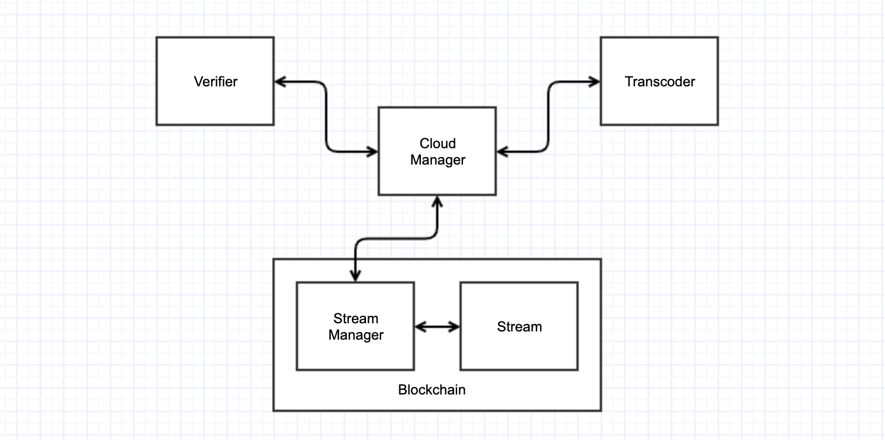
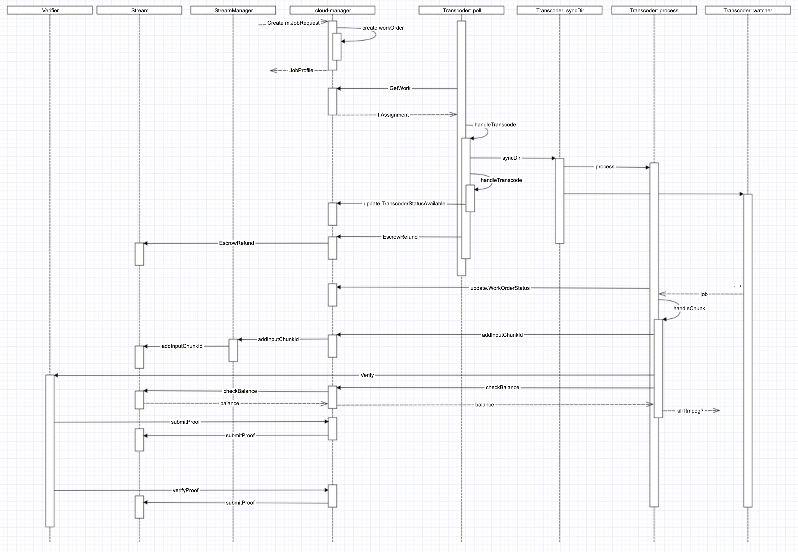

# SSIM based zkSNARK proving system integration

*This document describes the changes in videocoin infrastructure required for zk-SNARK proving system integration.*

## zkSNARK binaries

System consists of next binaries: `pot-keygen`, `pot-genproof`, `pot-verifyproof` (`pot` stands for Proof-of-Transcode) and will be installed into user binary directory.

`pot-keygen` will be used once on a setup phase to generate the keys, prover key will be placed along with transcoder worker in a specific directory. For this phase verifier key will be placed along with verifier worker (separate instance with standalone verifier) but in future, verifier should a smart contract and the key should be backed into it.

`pot-genproof` binary responsible for proof generation and will be placed together with transcoder worker software. Worker will use this binary along with prover key.

`pot-verifyproof` binary responsible for proof verification, supplied by transcoder worker, will be placed along with verifier worker software. Worker will use this binary along with verifier key.

## Components

Diagram below illustrates components involved into transcoding workflow.

*In general transcoding workflow is next. Client requests transcoding job. Each request is represented as Streaming smart contract on blockchain. When the job is ready clients starts to stream video. Video is split in chunks; transcoder will grab those chunks will produce transcoded chunks; transcoded chunks are uploaded to google cloud storage; also transcoder supplies stream smart contract with chunk ids; after the chunk is ready, transcoder notifies verifier to generate and verifies the proof and notifies smart contract.*

**Stream Manager** manages validator list, also is responsible for stream approval and creation.

**Stream** smart contract holds list of chunk ids, stores the proofs (currently contract doesn't store any proofs, it basically relies on validators).

**Transcoder** transcoder (or miner) worker, grabs chunks from input stream and produces transcoded with the following bitrate provided in the job.

**Verifier** instance calculates pHash based algorithm for transcoding verification.

**Cloud Manager** orchestrates transcoding workflow.

## Workflow

In existing implementation transcoder doesn't submits the proof, it relies on verifier worker. Introducing zkSNARK based proofs will change that. Sequence diagram below depicts existing transcoding process and the communication between the components.

